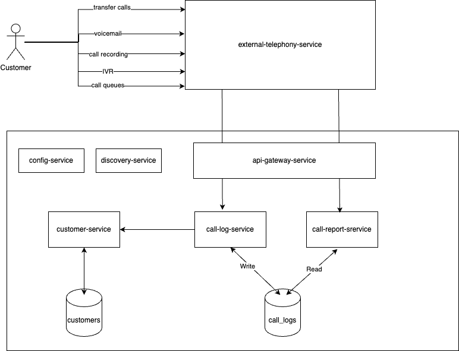

**Customer Relationship Management (CRM) Project**

---

### Overview

The Customer Relationship Management (CRM) project is a system to help to manage any kind of interaction with the company’s clients. This README provides an overview of the project structure, including its modules, high-level design, database design, how to run it, and access Swagger documentation.

### Modules

The CRM project is divided into the following modules:

1. **crm-common**: Contains shared functionality and data models used across multiple services.

2. **crm-call-log-service**: Provides functionality for managing call logs, including creating, updating, and deleting call logs.

3. **crm-call-report-service**: Offers detailed reports on call data for each customer, including the total number of calls, total duration, and latest sync date.

4. **crm-telephony-service**: Manages telephony-related tasks and integration with telephony systems.

### High-Level Design

The CRM project follows a microservices architecture, with each module responsible for specific functionalities.

- **crm-common**: Provides shared data models and utilities used by other services.

- **crm-call-log-service**: Handles CRUD operations for call logs. It interacts with the database to store and retrieve call log data.

- **crm-call-report-service**: Generates detailed reports on call data for customers. It retrieves data from the call log service and calculates metrics such as the total number of calls, total duration, and latest sync date.

- **crm-telephony-service**: Manages telephony-related tasks such as handling incoming calls, call routing, and integration with telephony systems.

- **crm-discovery-service**: Provides service discovery capabilities using Spring Cloud Netflix Eureka.

<div style="text-align:center">
    
</div>

### How to Run

To run the CRM project:

1. Build the project using local profile

```sh
mvn clean install
```

2. Start discovery service using:
```sh
java -jar crm-discovery-service/target/crm-discovery-service-0.0.1-SNAPSHOT.jar
```

3. Start every microservice using `java -jar` command, for example call log service:
```sh
java -jar crm-call-log-service/target/crm-call-log-service-0.0.1-SNAPSHOT.jar
```

### Accessing Swagger Documentation

Swagger documentation provides detailed information about the APIs exposed by each service. To access Swagger documentation:

1. Start the service for which you want to view Swagger documentation.
2. Open a web browser and navigate to the Swagger UI URL of the service (e.g., `http://localhost:8090/swagger-ui/index.html`).
3. Explore the available endpoints, request parameters, and response schemas using the Swagger UI interface.

---

#### TODO List
- Implement the api gateway and config servers.
- Increase test code coverage.
- Implement JWT authentication/authorization in the api gateway project.
- Implement zipkin for tracing.
